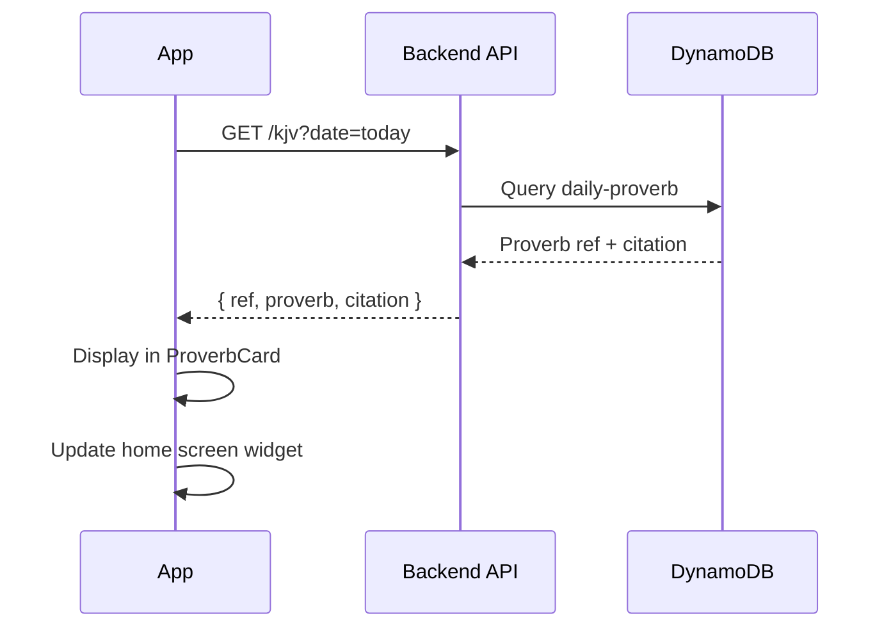
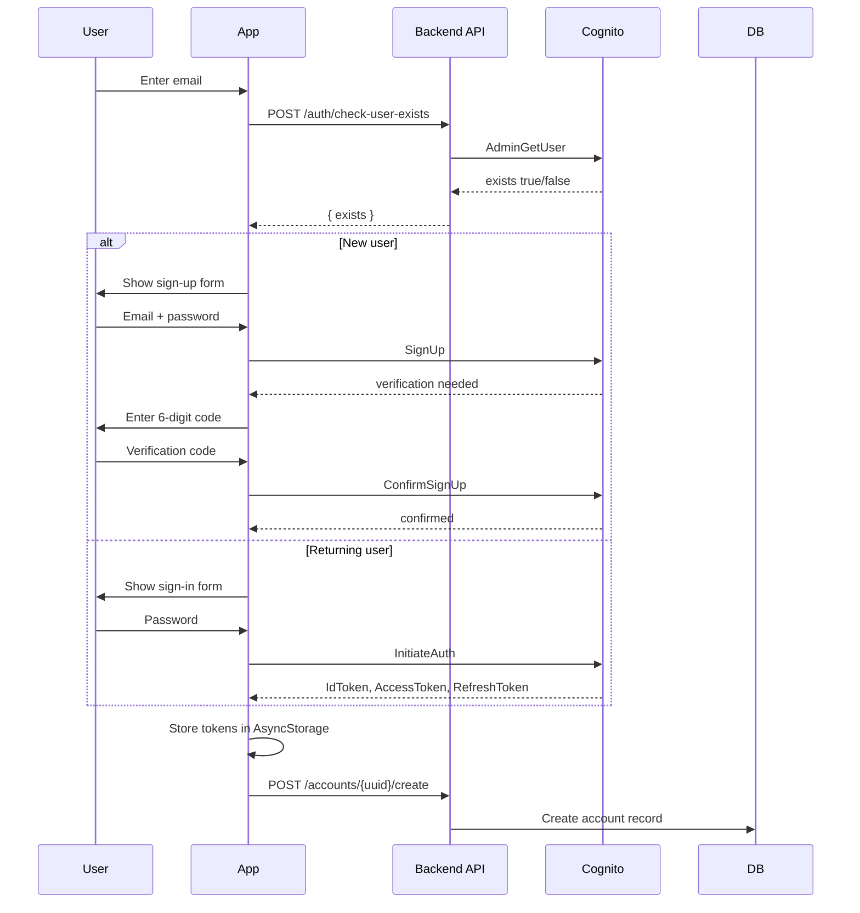
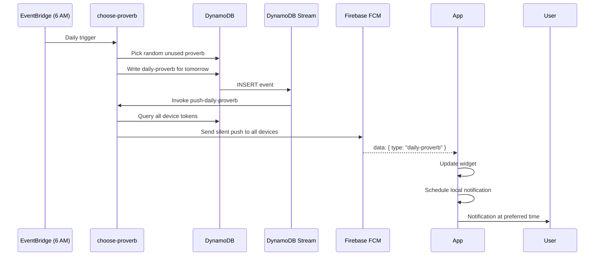
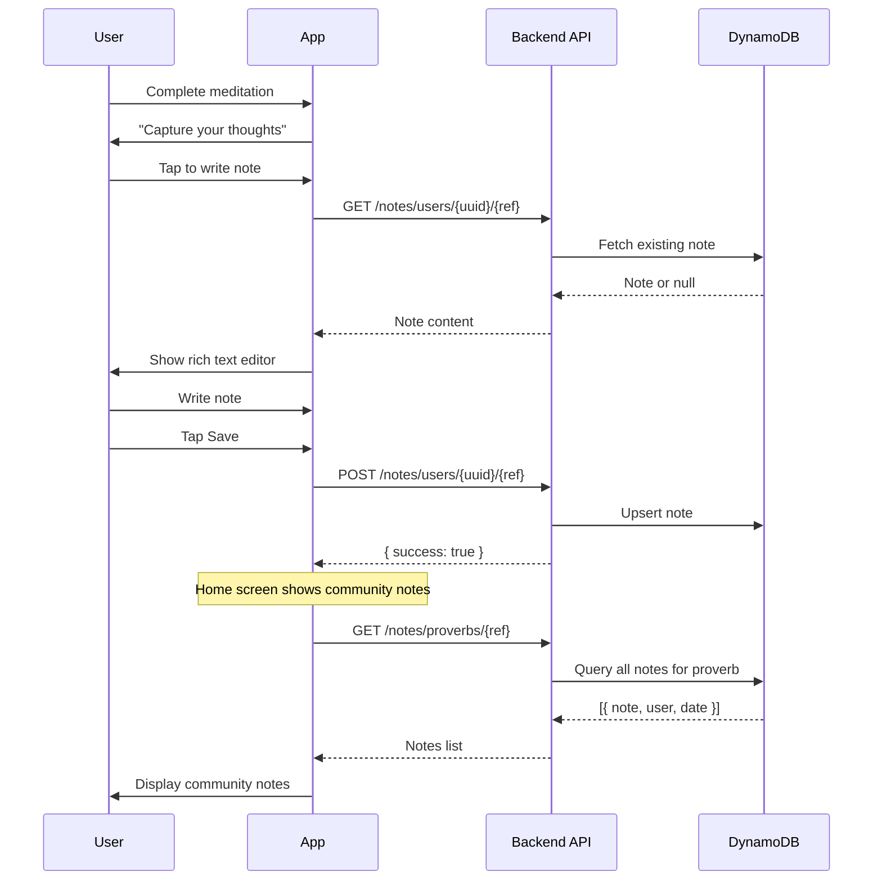

# Lemuel — A Daily Proverb App

Lemuel is a mobile app (Android & iOS) that brings you a new proverb every day. Read it, reflect on it, set reminders, and jot down your thoughts.

## What you can do

- **Daily proverb** — Each day a new proverb appears on the home screen. Choose from multiple Bible versions (KJV, NIV, ESV, etc.).
- **Home screen widget** (Android) — The day's proverb is always visible on your home screen, updating automatically.
- **Notifications** — Get a daily reminder to read the proverb. Choose a fixed time or a random window.
- **Meditation timer** — Focus on the proverb with a full-screen animated meditation experience. Afterward, capture your thoughts.
- **Notes & journaling** — Write rich-text notes for any proverb. See what others have written too (community notes).
- **Your account** — Sign up with email, track your stats (meditations completed, notes written).

## How it works

### Daily proverb flow



### Authentication flow



### Push notification flow



### Notes & journaling flow



## Tech stack

- **React Native** with Expo SDK 56
- **TypeScript** 6.0
- **Expo Router** (file-based navigation)
- **AWS Cognito** (authentication)
- **AWS Lambda + API Gateway** (backend, managed separately)
- **Voltra** (Android widgets)
- **react-native-reanimated** + **@shopify/react-native-skia** (animations)

## Getting started

```bash
# Install dependencies
pnpm install

# Run on Android (requires a development build, not Expo Go)
pnpm android

# Run on iOS
pnpm ios
```

## Development scripts

| Command | What it does |
|---|---|
| `pnpm start` | Start Expo dev server |
| `pnpm android` | Run on Android emulator/device |
| `pnpm ios` | Run on iOS simulator |
| `pnpm test` | Run tests (Jest) |
| `pnpm lint` | Lint with Biome |
| `pnpm typecheck` | TypeScript type checking |

## Project status

All core features are complete and working. Future plans include adding privacy controls for notes (public/private).

_Questions or feedback? Open an issue on the repository._
