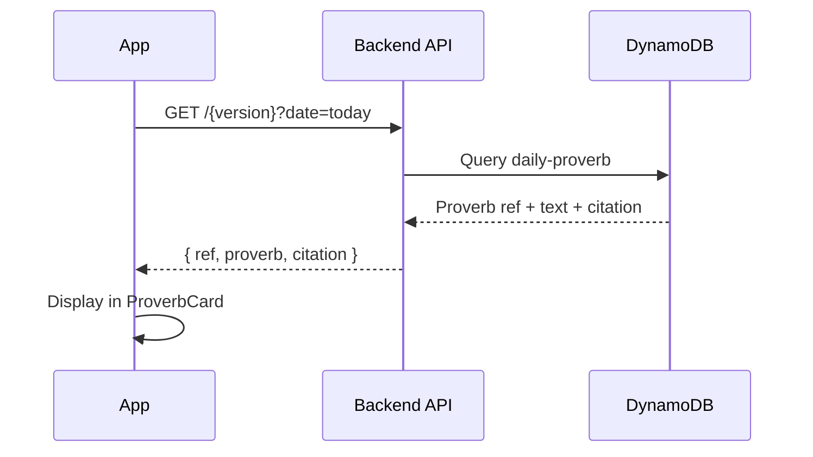
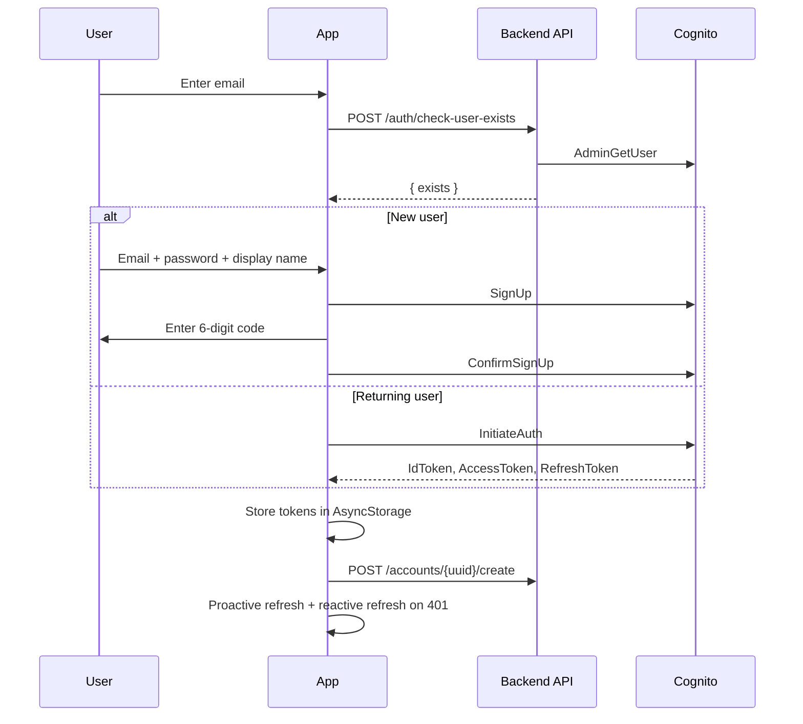
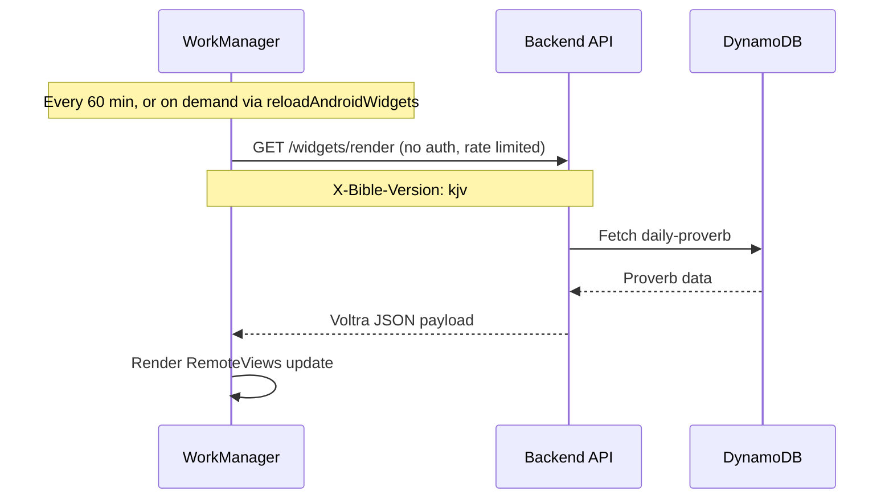
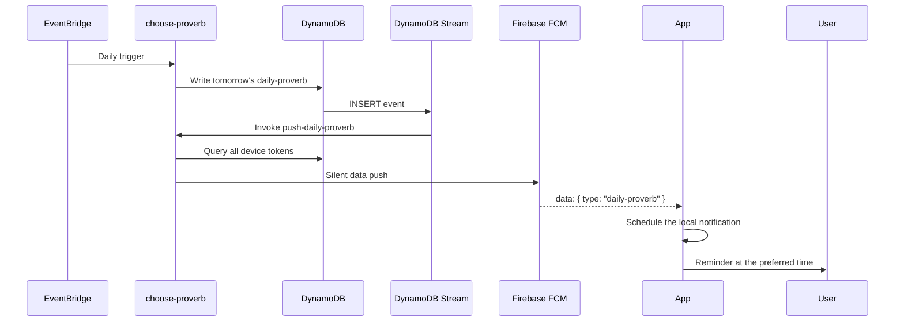
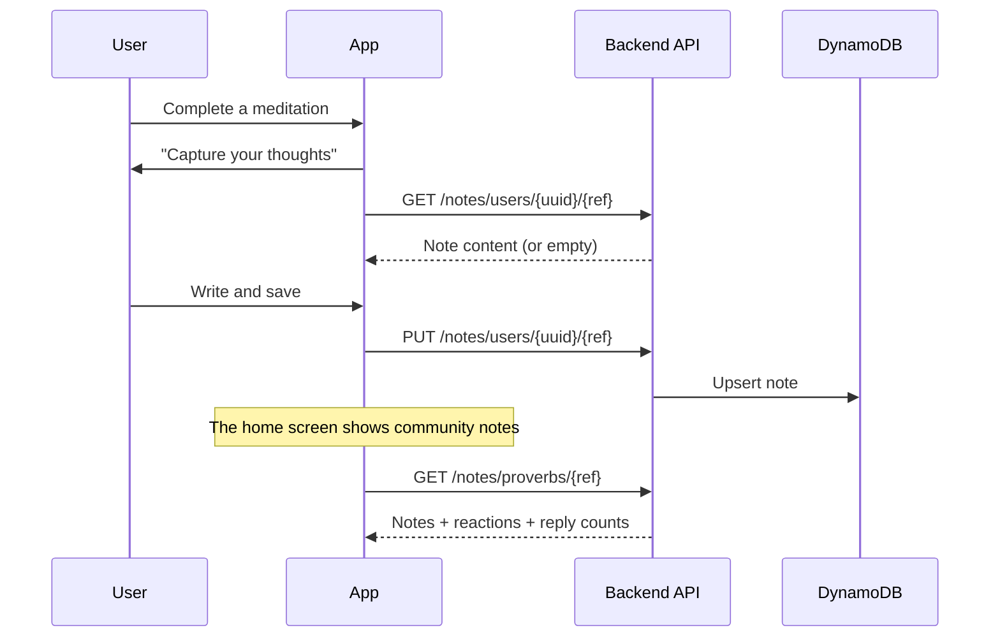

# Lemuel — A Daily Proverb App

Lemuel brings you a new proverb every day. Read it, reflect on it with a short
meditation, set a daily reminder, and jot down your thoughts.

It ships from a single Expo / React Native codebase to **Android** and **web**.

> ## Supported platforms
>
> **Android** and **web** are both first-class, actively supported targets, and
> **every change must work on both.** There is no platform that is "just a
> nice-to-have" — a feature that only works on one of them is an unfinished
> feature.
>
> - **Android** — the primary mobile experience, run as a development build.
>   This is the only platform with the home-screen widget, push notifications
>   and background scheduling, because those need native modules.
> - **Web** — a statically exported React Native Web app (`web.output:
>   "static"` in `app.config.ts`), served from EAS Hosting or any static host.
>
> iOS is scaffolded in `app.config.ts` and `package.json`, but it is **not**
> currently a supported or verified target — do not assume a change works on
> iOS just because it works on Android.

## What you can do

- **Daily proverb** — each day a new proverb appears on the home screen. Choose
  from multiple Bible versions (KJV, NIV, ESV, …), pull to refresh, and page
  back and forth by date. *(Android + web)*
- **Monthly calendar** — tap a date on a month grid to browse past proverbs.
  *(Android + web)*
- **Meditation timer** — a full-screen animated meditation on the proverb,
  ending with a "Capture your thoughts" prompt. The animation is rendered with
  Skia and adapts its shader complexity to the device's performance tier.
  *(Android + web — on web the Skia WASM runtime is fetched on demand)*
- **Notes & journaling** — write rich-text notes against any proverb, and read
  every other user's notes as community notes. *(Android + web)*
- **Reactions & replies** — react to a note with an emoji and reply in a
  thread. *(Android + web)*
- **Daily reminders** — get nudged to read the proverb at a fixed time or at a
  random point inside a window you choose. *(Android only)*
- **Home screen widget** — the day's proverb lives on your home screen,
  refreshed hourly by Android WorkManager whether or not the app is open.
  *(Android only)*
- **Your account** — sign up with email, set a display name, and track your
  stats (meditations completed, notes written). *(Android + web)*

## How it works

### Daily proverb


```mermaid
sequenceDiagram
    participant App
    participant API as Backend API
    participant DB as DynamoDB

    App->>API: GET /{version}?date=today
    API->>DB: Query daily-proverb
    DB-->>API: Proverb ref + text + citation
    API-->>App: { ref, proverb, citation }
    App->>App: Display in ProverbCard
```

### Authentication


```mermaid
sequenceDiagram
    participant User
    participant App
    participant API as Backend API
    participant Cognito

    User->>App: Enter email
    App->>API: POST /auth/check-user-exists
    API->>Cognito: AdminGetUser
    API-->>App: { exists }

    alt New user
        User->>App: Email + password + display name
        App->>Cognito: SignUp
        App->>User: Enter 6-digit code
        App->>Cognito: ConfirmSignUp
    else Returning user
        App->>Cognito: InitiateAuth
        Cognito-->>App: IdToken, AccessToken, RefreshToken
    end

    App->>App: Store tokens in AsyncStorage
    App->>API: POST /accounts/{uuid}/create
    App->>App: Proactive refresh + reactive refresh on 401
```

### Server-driven widget (Android)


```mermaid
sequenceDiagram
    participant WM as WorkManager
    participant API as Backend API
    participant DB as DynamoDB

    Note over WM: Every 60 min, or on demand via reloadAndroidWidgets
    WM->>API: GET /widgets/render (no auth, rate limited)
    Note over WM,API: X-Bible-Version: kjv
    API->>DB: Fetch daily-proverb
    DB-->>API: Proverb data
    API-->>WM: Voltra JSON payload
    WM->>WM: Render RemoteViews update
```

### Push notifications (Android)


```mermaid
sequenceDiagram
    participant Cron as EventBridge
    participant Lambda as choose-proverb
    participant DB as DynamoDB
    participant Stream as DynamoDB Stream
    participant FCM as Firebase FCM
    participant App

    Cron->>Lambda: Daily trigger
    Lambda->>DB: Write tomorrow's daily-proverb
    DB->>Stream: INSERT event
    Stream->>Lambda: Invoke push-daily-proverb
    Lambda->>DB: Query all device tokens
    Lambda->>FCM: Silent data push
    FCM-->>App: data: { type: "daily-proverb" }
    App->>App: Schedule the local notification
    App->>User: Reminder at the preferred time
```

### Notes & journaling


```mermaid
sequenceDiagram
    participant User
    participant App
    participant API as Backend API
    participant DB as DynamoDB

    User->>App: Complete a meditation
    App->>User: "Capture your thoughts"
    App->>API: GET /notes/users/{uuid}/{ref}
    API-->>App: Note content (or empty)
    User->>App: Write and save
    App->>API: PUT /notes/users/{uuid}/{ref}
    API->>DB: Upsert note

    Note over App: The home screen shows community notes
    App->>API: GET /notes/proverbs/{ref}
    API-->>App: Notes + reactions + reply counts
```

## Platform support in detail

The two platforms share almost everything: routing, state, API clients, styling
and business logic. Where a platform needs different code, it lives in a
platform-specific file that Metro picks automatically (`X.tsx` for native,
`X.web.tsx` for web).

| Concern | Android (native) | Web |
|---|---|---|
| Sign in | `src/screens/sign-in.tsx` | `src/screens/sign-in.web.tsx` |
| Settings | `src/screens/settings.tsx` | `src/screens/settings.web.tsx` |
| Meditation | `src/screens/meditation.tsx` | `src/screens/meditation.web.tsx` |
| Note editor | `src/components/note-editor.native.tsx` | `src/components/note-editor.web.tsx` |
| Reminders / scheduling | `src/notifications/daily-proverb-notification.ts` | `.web.ts` (no-ops) |
| Push listener | `src/notifications/push-listener.ts` | `.web.ts` (no-ops) |
| Notification taps | `src/notifications/notification-response.ts` | `.web.ts` (no-ops) |
| Device token | `src/api/push-token.ts` | `.web.ts` (no-op) |
| Dialogs | `src/utils/dialog.ts`, `src/utils/confirm.ts` | `.web.ts` |
| Widget bootstrap | `src/widgets/initializeWidget.android.ts` | `initializeWidget.ts` (no-op) |

What differs in practice:

- **Dialogs.** `Alert.alert` is a silent no-op in react-native-web, so the app
  never calls it. Everything goes through `src/utils/dialog.ts` (`showDialog` /
  `notify`) and `src/utils/confirm.ts`, which have real web implementations.
- **Reminders, push and the widget** are Android-only; on web the modules are
  no-ops and the settings page says so instead of offering dead controls.
- **The note editor** uses the `react-native-pell-rich-editor` on Android and a
  `contentEditable` element with `document.execCommand` on web.
- **Skia** runs natively on Android; on web the CanvasKit WASM bundle is
  loaded asynchronously (from the jsDelivr CDN) before the canvas mounts.
- **Page layout** is capped at a 1024px column on wide viewports, with the page
  background and the header bar still filling the whole width.

Everything else — the home screen, calendar, notes list, account page, auth
screens, reactions and replies — is a single shared implementation.

One build detail worth knowing: expo-router bundles **every** file under `app/`
on **every** platform, so a platform variant placed there would drag its imports
into the other platform's bundle. Route files are therefore platform-agnostic and
simply re-export the real screen from `src/screens/`, letting Metro pick the
right variant for each platform.

## Tech stack

- **Expo SDK 56** / **React Native 0.85** / **react-native-web 0.21**
- **TypeScript 6.0** (strict)
- **Expo Router** — file-based routing, static web export
- **AWS Cognito** — authentication (email + password, verification codes)
- **AWS Lambda + API Gateway + DynamoDB** — backend, deployed separately
- **Voltra** — server-driven Android widgets via WorkManager
- **react-native-reanimated** + **@shopify/react-native-skia** — the meditation
  animation
- **Jest** + **@testing-library/react-native** — tests
- **Biome** + **ESLint** — linting and formatting

## Getting started

```bash
# Install dependencies
pnpm install

# Web (no native toolchain needed)
pnpm web

# Android — requires a connected device or a running emulator
# (a development build; Expo Go is not supported)
pnpm android

# Start the configured emulator first, if you need one
pnpm emulator
```

The app talks to a deployed backend; the base URL lives in
`src/api/constants.ts` and the Cognito user pool in `config/cognito.ts`.

## Development scripts

| Command | What it does |
|---|---|
| `pnpm start` | Start the Expo dev server |
| `pnpm web` | Run the app in a browser |
| `pnpm android` | Build and run the Android development build |
| `pnpm preandroid` | Regenerate the native Android project (`expo prebuild --clean`) |
| `pnpm and-release` | Build and run the Android release variant |
| `pnpm emulator` | Launch the configured AVD |
| `pnpm emulator:cold` | Launch the AVD with a wiped data partition |
| `pnpm test` | Run the Jest suite (runs typecheck + lint first) |
| `pnpm test:watch` | Run Jest in watch mode |
| `pnpm typecheck` | `tsc --noEmit` |
| `pnpm lint` | Biome check |
| `pnpm lint:fix` | Biome check with safe fixes (`--unsafe` for import/format fixes) |
| `pnpm format` | Biome format |
| `pnpm lint:eslint` | ESLint |
| `pnpm deploy` | EAS production Android build |
| `pnpm android:submit` | Submit the latest Android build |

## Project structure

```
app/                          # Expo Router routes (thin re-exports, see below)
  _layout.tsx                 # Fonts, auth provider, notifications, stack nav, web content frame
  index.tsx                   # Home: daily proverb, community notes, date nav
  email-entry.tsx             # Email entry, checks whether the user exists
  sign-in.tsx                 # → src/screens/sign-in
  sign-up.tsx                 # Registration
  confirm-sign-up.tsx         # 6-digit verification code
  settings.tsx                # → src/screens/settings
  meditation.tsx              # → src/screens/meditation
  account.tsx                 # Profile, stats, display name, delete account
  notes/users/[uuid].tsx      # "My Meditations" list (auth-guarded)
  notes/users/[uuid]/[ref].tsx  # Note editor page

src/
  api/          # Backend clients (proverbs, versions, daily-proverbs, auth, cognito,
                # accounts, notes + reactions + replies, meditation, push-token, logs)
  auth/         # Auth context, token storage/refresh, `withAuth` route guard
  components/   # Shared UI (proverb card, note cards, note editors, reactions,
                # replies, menus, pickers, buttons, loading screen, meditation
                # canvas + capture button, …)
  constants/    # theme, layout (content width/inset/column), meditation constants
  hooks/        # useProverbForTheDay, useSettingsPreferences, useFitFontSize,
                # useUnsavedChanges, useDeviceTier, useMeditationShader,
                # useMeditationTimer, useMeditationSegments, useSerializedSave,
                # useAutoSave
  models/       # Zod schemas and response types
  notifications/# Scheduling, preferences, FCM push listener, tap routing
  screens/      # Screens with per-platform variants (sign-in, settings, meditation)
  settings/     # Meditation preferences, shared shader-selection rules
  utils/        # date, email, password, format, time-part, proverb-helper, dialogs,
                # layout, meditation-outline, shader
  widgets/      # Voltra Android widget

__tests__/      # Jest tests, mirroring the source tree
```

## Conventions

Short version — the full detail is in [`AGENTS.md`](./AGENTS.md):

- **Both platforms, every time.** Prefer shared code; reach for a
  platform-specific file only when the platforms genuinely differ, and keep the
  variants in sync.
- **Never use `Alert`.** Use `showDialog` / `confirm` / `notify`.
- **Keep web SSR-safe.** The web build statically renders every route, so no
  `window` / `document` access at module scope.
- **Document new functions** with concise TSDoc, and cover new behaviour with
  unit tests.
- `pnpm test` runs `typecheck → biome → eslint → jest` via `pretest`.

## Project status

Shipped: daily proverbs across multiple versions, the monthly calendar, the
Skia meditation timer, rich-text notes with community notes, emoji reactions and
threaded replies, Cognito account management, Android daily reminders with
sent-date deduplication, the server-driven Android home-screen widget, and a
full web build with its own sign-in, settings, meditation and note-editing
implementations.

Known gaps:

- The **private-note flag** is stored and shown in the editor, but it is not yet
  enforced — all notes are currently visible to everyone.
- Reminders, push notifications and the home-screen widget are Android-only by
  nature; the web settings page explains this rather than hiding it.

_Questions or feedback? Open an issue on the repository._
